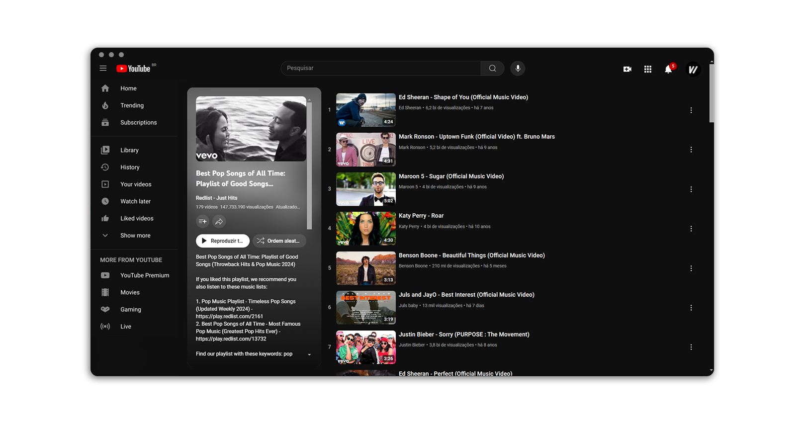

 

    
    <h1 align="center">Youtube Playlist Grid</h1>

<strong>An extension that enables changing the YouTube playlist to grid display view.</strong>

## Youtube default playlist viewer

## Youtube plalist in grid viewer
